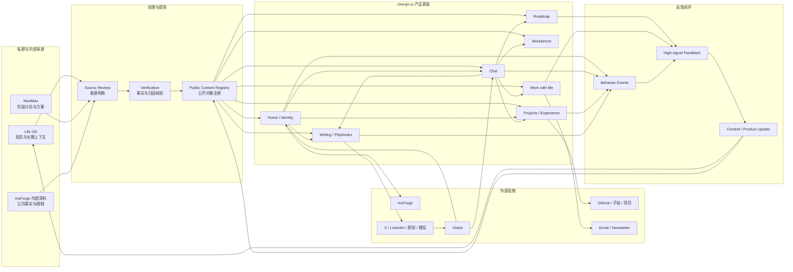

# chenjin.io 个人网站系统定义与全连接地图

日期：2026-08-17  
状态：设计准源 v0.1  
用途：为后续首页设计、信息架构、内容治理、Chat 系统、后端连接和迭代排期提供共同基线。

## 0. 文档结论

chenjin.io 不是个人简历、纯博客、InsForge 营销页，也不是把 Life OS 搬到公网。它应该是：

> 一个由当前职业实践建立信任、由公开作品证明能力、由对话调用知识、由真实反馈持续更新的个人系统公开接口。

网站首先用“AI 产品全球化增长、InsForge 增长负责人、Launch Week 结果”让陌生人迅速理解陈今现在做什么；随后通过案例、文章、Playbook、工作台和项目证明她如何把模糊问题转化为可执行系统；最后通过 Chat、Roadmap、订阅、产品和合作入口，让访客获得帮助并建立下一步关系。

这个定义包含四个并列但不混用的职责：

1. **身份与信任入口**：回答“你是谁、为什么值得相信”。
2. **公开知识与作品系统**：回答“你做过什么、怎么思考、我能获得什么”。
3. **对话式调用界面**：帮助访客带着自己的问题进入网站，而不是自行理解复杂栏目。
4. **反馈与关系闭环**：把阅读、提问、请求、产品使用和合作意向转化为下一轮内容、产品和判断。

因此，Hero 的职业定位是入口，不是网站的全部；InsForge 是当前最强的事实背书，不是个人品牌地基；Chat 是网站的交互层，不是装饰性的 AI 输入框；Life OS 和 NewMax 是后台来源，不是默认公开内容。

---

## 1. 研究范围、来源层级与置信度

### 1.1 本轮读取的三类来源

| 来源层 | 主要位置 | 它能回答什么 | 不能直接决定什么 |
|---|---|---|---|
| 当前产品层 | `/Users/jinchen/Documents/Projects/chenjin.io` | 当前代码、页面、文案、内容对象、视觉系统、Chat 路由和真实技术债 | 长期身份是否已经最终定型 |
| 阶段讨论与方案层 | `/Users/jinchen/.newmax`、`/Users/jinchen/Downloads/.newmax` | 最近的 Hero 讨论、Iris 对标、个人 IP、私域、商业化、InsForge 与个人身份边界等阶段方案 | 每份 AI 生成方案是否都被本人接受 |
| 长期事实与自我理解层 | `/Volumes/Elements SE/Backups/2026-08-14-preinstall/D/chenjin-life-os` | 个人网站的长期动机、自我理解、可迁移能力、公域输出、职业证据、Life OS/Agent OS 边界和历史演化 | 哪些私密材料可以直接公开 |

移动硬盘中的 2026-08-14 preinstall 备份作为本轮 Life OS 主读取快照。较早迁移副本只作为来源存在性和历史路径参考，不重复把同一份材料当成多个独立证据。

### 1.2 判断等级

本文所有结论按以下四级理解：

| 等级 | 定义 | 本文用法 |
|---|---|---|
| A：当前确认 | 用户近期明确表达，且当前项目或记录可核对 | 直接作为 v0.1 设计默认值 |
| B：跨来源稳定 | 在当前代码、NewMax、Life OS 多处重复出现 | 作为网站长期结构原则 |
| C：阶段假设 | 出现在旧规格、顾问建议或 AI 方案中，但未确认长期采用 | 保留位置，不当作最终承诺 |
| D：私密或不可公开 | 原始聊天、内部指标、健康/关系材料、凭证、数据库等 | 只用于内部判断，默认不进入网站 |

### 1.3 当前确认与稳定内核

**A 级当前确认：**

- Hero 需要让访客一眼理解“AI 产品全球化增长”。
- 当前身份为“陈今｜InsForge 增长负责人”。
- 当前价值表达为“让 AI Coding 产品被全球开发者发现、使用并持续增长”。
- Launch Week 1 可作为核心项目证据；结果归属于项目和团队，个人角色需准确描述。
- Hero 右侧需要个人照片。
- Hero 下方需要一个可以立即 Chat with me 的入口。
- 网站视觉需要延续 chenjin.io 现有风格，而不是重做成普通 SaaS 落地页。

**B 级跨来源稳定内核：**

- 陈今反复表现出的核心能力不是单一渠道运营，而是研究、结构化表达、系统化归类、快速启动、阶段闭环、连接与增长。
- 公域输出的作用是把真实经历和判断变成作品，再通过反馈积累信用、连接、机会和选择权。
- 网站负责“展示、证明和转化价值”；公域渠道负责“发现和验证价值”；Life OS 负责“保存现实与长期上下文”。
- 网站必须是个人长期资产。InsForge、Atoms 或未来公司都可以成为经历和证据，但不能控制网站的核心身份、域名、内容归属和用户关系。
- Chat-first 不是要求取消页面，而是用对话降低访客理解信息架构的成本。
- 公开内容必须来自真实项目、真实经验、真实判断或明确标注的探索，不把未经验证的假设包装成方法论。

### 1.4 仍然属于阶段假设的内容

- “AI-Native，让人有勇气过不被定义的人生”可以保留为长期价值观来源，但不适合直接替代当前 Hero 职业定位。
- “self-as-SaaS”适合作为内部产品设计原则，不必成为访客看到的概念。
- 六层“个人 IP 宇宙”是历史生态原型，不应一次性全部建设。
- WorkBuddy、付费知识库、199 元咨询、社群等商业形态是可验证方向，不应在未运行前全部放到首页。
- “文科生转 AI”是个人路径和一部分用户的共鸣入口，不应与“AI 产品全球化增长”并列争夺 Hero 主标题。
- “增长工程”“Agent Infra”“Human × AI”是能力和世界观的纵深层，不应在首屏堆成行业黑话。

---

## 2. 目标校准：这个网站真正要完成什么

### 2.1 表面目标与真正目标

表面目标是设计一个更清晰、更好看的个人网站。真正目标是建立一个长期归属于个人、能够随职业和能力变化持续演化的公开接口，使陌生人完成以下状态转变：

```text
不知道陈今是谁
→ 迅速理解她当前做什么
→ 用事实判断她是否可信
→ 找到与自己问题相关的内容或能力
→ 通过阅读、对话、产品或合作获得下一步
→ 把反馈重新带回陈今的内容与产品系统
```

### 2.2 网站成功的必要结果

网站上线后至少应产生四类可观察结果：

1. 访客能在首屏复述陈今当前的职业定位和核心能力。
2. 访客能找到至少一个与自身问题相关的案例、文章、方法或工具。
3. 访客能直接提问，并得到有来源、有边界、可继续行动的响应。
4. 高意向访客能自然进入 InsForge、GitHub、订阅、咨询或合作路径，不需要四处寻找联系方式。

### 2.3 明确不做什么

- 不把所有人生经历、健康经历、关系记录和私人聊天公开化。
- 不在首页平铺所有职位、技能、平台、工具、服务和产品。
- 不把个人网站变成 InsForge 官网的附属渠道。
- 不用粉丝数、页面数量或 AI 功能数量代替有效价值。
- 不为了“系统感”提前建设没有内容和反馈支撑的栏目。
- 不让 Chat 无限制访问原始 Life OS、内部公司资料或私人数据库。
- 不让同一份身份、证据、CTA 和内容元数据散落在多个页面独立维护。

---

## 3. 金字塔总结构

### 3.1 顶层结论

```text
chenjin.io = 个人长期职业与认知资产的公开产品表面
```

### 3.2 第一层支柱

```text
个人公开产品表面
├── A. 让人迅速理解并信任我
├── B. 让人调用我的作品、知识和方法
├── C. 让人用自己的问题与我建立对话
└── D. 让价值进入产品、合作和反馈闭环
```

### 3.3 第二层论据

```text
A. 理解与信任
├── 当前身份：AI 产品全球化增长 / InsForge 增长负责人
├── 一句话价值：让 AI Coding 产品被发现、使用并持续增长
├── 核心证据：InsForge Launch Week 1
├── 个人照片：让职业信息与真实的人建立连接
└── 经历路径：Atoms、转入 AI、早期跨领域经历

B. 作品、知识与方法
├── Projects：已完成和正在构建的真实作品
├── Writing：观点、复盘、案例与真实表达
├── Playbooks：可复用的结构化方法
├── Workbench：工具、工作流、信息源与使用证据
└── Experience：职业证据与能力演化

C. 对话
├── 认识陈今
├── 带着问题获得建议
├── 查找相关内容或工具
├── 请求陈今下一步研究或输出
└── 判断是否适合合作

D. 闭环
├── 访问 InsForge / GitHub / 项目
├── 订阅或持续关注
├── 提交 Roadmap 请求
├── 发起咨询或合作
└── 反馈进入下一轮公开内容与产品更新
```

---

## 4. 身份系统：避免把阶段职位等同于整个人

### 4.1 四层身份栈

| 层级 | 当前表达 | 作用 | 稳定性 |
|---|---|---|---|
| 入口身份 | AI 产品全球化增长；InsForge 增长负责人 | 让陌生人快速理解 | 随职业阶段更新 |
| 专业能力 | Launch、开发者增长、全球分发、采用与增长系统 | 证明能解决什么问题 | 中长期稳定 |
| 工作方式 | 研究、结构化表达、系统化归类、AI 工作流、轻量构建 | 解释为什么能做成 | 长期稳定 |
| 价值观与世界观 | 化混沌为清晰；公开校准；Human × AI；AI Native | 形成个人辨识度 | 最长期稳定 |

首页只需要先讲清前两层。第三层通过项目和方法呈现，第四层通过 About、写作和长期叙事自然显现。

### 4.2 InsForge、Atoms 与个人品牌的关系

```text
个人品牌（地基）
├── 当前职业实践：InsForge（最强现实证据）
├── 前序产品经验：Atoms / MetaGPT（能力演化证据）
├── 独立项目：网站、研究、工具和公开实验（自主性证据）
└── 长期方法与判断：增长、AI 工作流、个人系统（可迁移资产）
```

- InsForge 可以出现在 Hero、证据带、项目详情、Experience 和产品链接中。
- Atoms 主要进入 Experience 和从 AI App Builder 到 Agent-native backend 的能力演化叙事，不必占用 Hero。
- 公司结果必须区分团队结果、个人职责和可公开证据。
- 公司内部数据、Slack、用户数据、预算和未经批准的信息不能通过网站或 Chat 暴露。

---

## 5. 目标访客与问题路由

网站不应把所有人写进同一句 Hero。Hero 使用当前最具体、最有证据的职业定位；不同访客在后续内容和 Chat 中分流。

| 访客 | 进入时的问题 | 需要看到的证据 | 优先去向 | 可能的下一步 |
|---|---|---|---|---|
| AI 产品、开发者工具创始人/团队 | 产品如何进入全球市场并获得真实采用 | Launch、渠道、增长系统、产品数据判断 | Projects、Playbooks、Writing | 讨论增长、合作、InsForge |
| Growth、PMM、运营同行 | 如何把渠道动作变成可复用增长系统 | 框架、复盘、工作流、指标边界 | Playbooks、Writing、Workbench | 订阅、交流、联合输出 |
| Agent/Coding/工作流实践者 | 如何用 AI 和轻量代码提高真实工作效率 | 工具使用、构建过程、具体工作流 | Workbench、Projects、Chat | 使用模板、尝试工具、提问 |
| 非技术背景的 AI 转型者 | 如何理解技术、建立作品和进入 AI 行业 | 陈今的转型路径、项目与学习过程 | Experience、Writing、Chat | 获得路径建议、阅读系列内容 |
| 合作者、招聘者、媒体、活动方 | 陈今是谁，做过什么，适合什么合作 | 清晰身份、公开证据、履历和联系方式 | About、Experience、Work with me | 发起合作或邀请 |
| 长期读者与同频者 | 她如何理解 AI、工作、成长与真实表达 | 文章、书架、公开构建和价值观 | Writing、Roadmap、Chat | 反馈、持续关注、提出请求 |

---

## 6. 高内聚模块树

高内聚要求每个模块只承担一类核心职责；低耦合要求模块通过明确数据和动作接口连接，而不是相互读取对方内部实现。

```text
chenjin.io
├── 0. Global Shell / 全局壳层
│   ├── Navigation
│   ├── Footer
│   ├── Language
│   ├── Theme
│   └── SEO / Analytics 基础
│
├── 1. Identity & Trust / 身份与信任
│   ├── Hero
│   ├── Portrait
│   ├── Current Role
│   ├── Proof Band
│   ├── About
│   └── Experience
│
├── 2. Knowledge / 公开知识
│   ├── Writing
│   ├── Playbooks
│   ├── Bookshelf
│   ├── Tags / Topics
│   └── Related Content
│
├── 3. Work / 作品与案例
│   ├── Projects
│   ├── Case Studies
│   ├── Experiments
│   ├── Public Reports
│   └── External Artifacts
│
├── 4. Workbench / 工具与工作流
│   ├── Core Stack
│   ├── Growth & Distribution
│   ├── Build & AI
│   ├── Infrastructure
│   ├── Sources
│   └── Saved for Evaluation
│
├── 5. Conversation / 对话层
│   ├── Hero Chat
│   ├── Floating Chat
│   ├── Public Knowledge Retrieval
│   ├── Intent Routing
│   ├── Recommendation Actions
│   └── Human Handoff
│
├── 6. Roadmap & Feedback / 请求与反馈
│   ├── Public Build Plan
│   ├── Reader Requests
│   ├── Voting / Signal
│   ├── Status
│   └── Changelog Link
│
├── 7. Relationship & Conversion / 关系与转化
│   ├── Work with Me
│   ├── Contact
│   ├── Newsletter / Subscription
│   ├── InsForge Product Link
│   ├── Social Profiles
│   └── Speaking / Collaboration
│
├── 8. Content Registry / 内容注册层
│   ├── Identity Claims
│   ├── Evidence
│   ├── Projects
│   ├── Articles
│   ├── Playbooks
│   ├── Tools
│   ├── Services
│   └── Roadmap Items
│
├── 9. Feedback & Measurement / 反馈与测量
│   ├── Page Events
│   ├── Chat Events
│   ├── Content Feedback
│   ├── Request Signals
│   ├── External Clicks
│   └── Effective Feedback Loops
│
└── 10. Governance / 来源、隐私与发布治理
    ├── Source Boundary
    ├── Public / Private Classification
    ├── Evidence Review
    ├── Claim Attribution
    ├── Content Status
    └── Update Ownership
```

### 6.1 模块职责与唯一改变原因

| 模块 | 单一职责 | 输入 | 输出 | 主要改变原因 |
|---|---|---|---|---|
| Identity & Trust | 让人理解并相信陈今 | 身份声明、履历、证据、照片 | Hero、About、Experience | 职业身份或证据变化 |
| Knowledge | 提供可阅读、可复用的判断 | 已公开文章、方法、书摘 | Writing、Playbooks、相关内容 | 新内容或分类规则变化 |
| Work | 展示真实做过和正在构建的东西 | 项目事实、结果、过程、链接 | 项目页、案例页、报告页 | 项目生命周期变化 |
| Workbench | 说明工具和工作流如何被使用 | 工具事实、状态、使用记录 | 工具地图、工作流、外链 | 工具实际使用状态变化 |
| Conversation | 用问题调用公开知识并路由下一步 | 访客消息、公共 Registry | 回答、推荐、动作 | 对话能力或路由策略变化 |
| Roadmap & Feedback | 接收需求并展示公开计划 | 项目计划、读者请求、投票 | 状态池、请求入口 | 优先级和状态变化 |
| Relationship & Conversion | 提供持续关系和合作入口 | 服务、联系、订阅、外部产品 | 联系、订阅、合作、跳转 | Offer 或联系渠道变化 |
| Content Registry | 统一维护页面与 Chat 共用数据 | 已审核公共内容对象 | 标准化查询接口 | 内容模型变化 |
| Measurement | 判断网站是否产生真实价值 | 行为事件、反馈、转化 | 复盘和决策信号 | 指标定义或分析需求变化 |
| Governance | 决定什么可以公开、如何归因 | Life OS、NewMax、公司资料、证据 | 发布状态和边界 | 来源、权限或隐私变化 |

---

## 7. 页面信息架构

### 7.1 主导航

```text
Home
├── Writing
├── Projects
├── Playbooks
├── Workbench
├── Roadmap
└── Work with Me

辅助入口
├── Experience
├── Bookshelf
├── About
├── Chat
└── Language / Theme
```

主导航不再额外平铺 Blog、Tools、Sources、Tutorials、Social 和 Support；这些概念分别收敛到 Writing、Workbench、Playbooks、Footer 和 Work with Me 中。旧 URL 可以继续重定向，但不应形成第二套信息架构。

### 7.2 首页完整结构

```text
1. Hero：当前身份、价值、证据、个人照片
2. Immediate Chat：立即描述问题并获得路径
3. What I Actually Do：三类专业能力
4. Selected Proof：一个主案例 + 少量可验证结果
5. Explore by Need：按问题进入 Writing / Projects / Playbooks / Workbench
6. Current Work & Experiments：正在构建和公开验证的事项
7. About & Journey：个人路径、工作方式和长期主线
8. Work with Me：适合与不适合的合作
9. Stay Connected：订阅、社交、邮箱、Roadmap
10. Footer：版权、声明、外部链接
```

首页不需要把每个子页面内容复制一遍。每个区块只完成“理解、证明、分流、行动”中的一个任务。

### 7.3 子页面职责

| 路由 | 页面承诺 | 主要内容对象 | 主要 CTA |
|---|---|---|---|
| `/` | 认识陈今并找到最适合自己的入口 | Identity、Evidence、Featured objects、Chat | 开始对话 |
| `/writing` | 阅读真实判断、复盘与长期思考 | Article、Book note | 继续阅读 / 对话 |
| `/projects` | 查看已经做成和正在验证的作品 | Project、Case、Experiment | 查看项目 / 讨论 |
| `/playbooks` | 获得可以按步骤执行的方法 | Playbook、Chapter、Template | 开始实践 / 提问 |
| `/workbench` | 查看真实使用中的工具和工作流 | Tool、Workflow、Source | 使用工具 / 查看方法 |
| `/roadmap` | 查看陈今在构建什么并提出请求 | RoadmapItem、Request | 提交请求 / 投票 |
| `/experience` | 核对职业路径和能力演化 | Experience、Evidence | 查看案例 / 联系 |
| `/work-with-me` | 判断是否适合合作并进入明确下一步 | Service、Fit、Boundary、Contact | 发起合作 |
| `/writing/bookshelf` | 查看影响陈今判断的阅读与笔记 | BookNote | 阅读相关写作 |

---

## 8. 首页 Hero 与首屏交互定义

### 8.1 文案结构

```text
AI 产品全球化增长

陈今｜InsForge 增长负责人

让 AI Coding 产品被全球开发者发现、使用并持续增长

InsForge Launch Week
Product Hunt 周榜 #1 · GitHub Trending #1 · X 曝光 150 万+ · 7 天新增 3K+ GitHub Stars

[探索实践]  [了解 InsForge]
```

以上数字按当前用户确认版本保留为设计稿口径；正式上线前仍需将每个数字与公开证据、时间范围和个人归因方式绑定。

### 8.2 视觉结构

```text
桌面端
┌──────────────────────────────────────────────────────┐
│ 左：身份 / 价值 / 证据 / CTA      右：个人照片       │
│                                                      │
│ ─────────────── Chat with me ────────────────────── │
│ [告诉我你在做什么，我会从案例、方法和工具中帮你找路径] │
└──────────────────────────────────────────────────────┘

移动端
身份 → 价值 → 照片 → 证据 → CTA → Chat
```

个人照片不是单独的装饰图。它承担“把专业声明连接到真实的人”的信任职责。推荐使用自然、清晰、当前、不过度企业化的半身职业照片；背景和色调应融入月白、青黛、翠涛体系，不使用厚重黑色商务肖像或夸张 AI 光效。

### 8.3 首屏动作层级

1. **核心交互行为：Chat with me**。访客可以不理解导航，直接说自己的问题。
2. **低门槛浏览行为：探索实践**。进入按问题组织的精选作品/内容入口。
3. **产品了解行为：了解 InsForge**。前往 InsForge 的明确产品介绍或官方页面。

Chat 可以位于 Hero 正文下方独占整行，视觉上比普通 Footer 浮窗更有存在感，同时不必删除“探索实践”和“了解 InsForge”。

---

## 9. Chat 系统定义

### 9.1 Chat 不是什么

- 不是通用聊天机器人。
- 不是没有后端的输入框装饰。
- 不是让访客直接搜索私密 Life OS。
- 不是只会把人推到咨询页面的销售客服。
- 不是每次都生成一段没有来源的泛化建议。

### 9.2 Chat 的五个职责

1. 理解访客的背景、问题和当前阶段。
2. 从公开知识中找到相关案例、文章、Playbook、工具和经历。
3. 给出简短、明确、有边界的初步回答。
4. 推荐一个主要下一步和少量相关入口。
5. 当现有内容无法回答时，把问题转化为 Roadmap 请求或人工联系，而不是假装知道。

### 9.3 对话意图树

```text
访客消息
├── 想认识陈今
│   └── About / Experience / Featured work
├── 有增长或全球化问题
│   └── Growth cases / Playbooks / Work with Me
├── 有 Agent、Coding、自动化或工具问题
│   └── Workbench / Projects / Tutorials
├── 想看观点与方法
│   └── Writing / Bookshelf / Related content
├── 想合作
│   └── Fit check / Offer / Contact
├── 想让陈今研究或制作某项内容
│   └── Roadmap request
└── 现有内容无法覆盖
    └── 明确未知 → 收集上下文 → 人工接续或进入请求池
```

### 9.4 对话数据链

```text
Message
→ Intent + Context
→ Public Content Registry 检索
→ Evidence-aware Answer
→ Recommended Objects
→ One Primary Action
→ Feedback Event
→ Roadmap / Contact / Content update
```

### 9.5 Chat 知识边界

Chat 默认只读取标记为 `public` 的内容对象。`internal`、`private`、`company-confidential`、`personal-sensitive` 和 `unverified` 内容不能进入检索索引。Chat 引用个人或公司成绩时应同时返回来源或证据页面；没有公开证据时，使用更保守的表述。

---

## 10. 内容对象模型

页面和 Chat 不应各自维护一套内容。所有可公开内容先进入统一 Registry，再由不同界面读取。

### 10.1 核心对象

| 对象 | 必要字段 | 被谁使用 |
|---|---|---|
| `IdentityClaim` | id、短句、层级、状态、有效期、来源 | Hero、About、SEO、Chat |
| `Evidence` | claimId、结果、时间范围、个人角色、团队归因、公开来源 | Hero 证据带、Project、Experience、Chat |
| `Article` | title、excerpt、body、topic、audience、related、status | Writing、Chat、SEO |
| `Project` | problem、role、process、result、evidence、status、links | Projects、Hero、Chat |
| `Playbook` | outcome、audience、steps、inputs、limits、evidence | Playbooks、Chat、Writing |
| `Tool` | category、status、use case、why、actual usage、url | Workbench、Chat |
| `Workflow` | problem、inputs、steps、tools、output、limitations | Workbench、Playbooks、Chat |
| `Experience` | company、role、period、scope、evidence、relatedProjects | Experience、About、Chat |
| `Service` | problem、fit、notFit、deliverable、boundary、contact | Work with Me、Chat |
| `RoadmapItem` | type、status、why、requesterSignal、route | Roadmap、Chat、Home |
| `ExternalLink` | owner、type、url、language、trackingPolicy | Navigation、Footer、CTA |

### 10.2 共用治理字段

所有对象应共用：

```text
visibility: public | internal | private
verification: verified | source-backed | hypothesis | unverified
ownership: personal | team | external
language: zh | en | bilingual
updatedAt
sourceRefs
relatedIds
primaryAction
```

这些字段保证 UI、Chat、SEO、分析和未来后端使用同一事实边界。

---

## 11. 跨模块连接网



### 11.1 关键接口矩阵

| 上游 | 下游 | 只允许传递 | 不允许传递 |
|---|---|---|---|
| Life OS | Source Review | 来源指针、可公开候选、事实摘要 | 整库、私聊、原始健康/关系资料 |
| NewMax | Source Review | 阶段方案、用户确认记录、假设 | 把 AI 草案直接视为用户决定 |
| InsForge | Verification | 已批准的公开事实、产品链接、角色说明 | 内部用户数据、预算、Slack、未授权指标 |
| Verification | Registry | 已分级的 Claim、Evidence 和内容对象 | 无来源数字、模糊个人归因 |
| Registry | Pages | 标准内容对象 | 页面自行发明另一套事实 |
| Registry | Chat | `public` 且允许检索的对象 | private/internal/unverified 对象 |
| Chat | Roadmap | 无法回答的问题、内容请求 | 未经同意保存敏感个人上下文 |
| Chat | Work with Me | 明确合作意图和用户主动提供的联系信息 | 暗中销售画像或自动外联 |
| Site Events | Feedback | 聚合行为信号、匿名或合规标识 | 不必要的敏感数据和原始输入全文 |
| Feedback | Life OS | 已处理的高信号反馈和新判断 | 把每次点击都资产化 |

---

## 12. 链接系统

### 12.1 内部链接规则

- Hero 的“探索实践”进入一个按问题组织的聚合入口，不直接丢进时间流博客。
- 每个 Project 至少连接：相关 Evidence、Writing、Playbook、Tool、下一步动作。
- 每篇 Writing 至少连接：一个相关项目/方法、一个继续行动入口。
- 每个 Playbook 至少连接：来源案例、适合人群、限制、可操作下一步。
- 每个 Tool 至少说明：真实使用状态、用在什么工作流、是否只是收藏。
- Chat 推荐优先返回内容对象，其次返回栏目页，最后才返回联系入口。
- Roadmap 完成项应连接到已经发布的页面，不保留孤立“已完成”。
- Work with Me 应连接公开证据，不仅展示服务名称。

### 12.2 外部链接规则

| 外部目的地 | 网站中的角色 | 推荐位置 | 追踪原则 |
|---|---|---|---|
| InsForge | 当前职业实践与产品入口 | Hero、Experience、相关 Project | 记录来源页面与 CTA，不追踪敏感身份 |
| GitHub | 代码、项目、公开资产和可信度 | Projects、Workbench、Footer | 区分个人 repo、组织 repo、外部 repo |
| X / LinkedIn | 实时观点、职业关系与分发 | Footer、About、Writing | 用 UTM 区分页面来源 |
| 即刻 / 微信生态 | 中文公域表达和长期信任 | Footer、Contact、文章作者信息 | 不把二维码和账号堆满 Hero |
| Email / Newsletter | 可持续关系 | Writing、Footer、Chat 后续 | 明确订阅内容与退订规则 |
| 子站 / 报告 / 工具 | 独立作品 | Project 详情 | 保持主站可返回路径和统一归属 |

---

## 13. 高内聚低耦合的技术与内容规则

### 13.1 内容与页面解耦

- 身份、证据、项目、文章、工具、服务和路线图数据不能硬编码在多个页面。
- 页面只负责布局和交互，Registry 负责内容事实，Governance 负责公开边界。
- 中英文内容使用同一对象模型，不在页面内散落大量 `isZh ?` 文案。
- About、Hero、SEO 和 Chat 引用同一个 `IdentityClaim`，但可以有不同长度版本。

### 13.2 Chat 与模型提供商解耦

```text
Chat UI
→ Conversation API Contract
→ Retrieval / Routing
→ Model Adapter
→ Public Registry
```

前端不直接绑定某一家模型。未来可以替换 OpenAI、Claude、本地模型或规则路由，而不重写 Hero 和 Floating Chat。检索、回答、动作推荐、人工接续分别保留接口。

### 13.3 外部产品与个人站解耦

- InsForge 提供后端时，只通过 Backend Adapter 接入；个人域名、视觉、内容、用户同意和邮件身份保持独立。
- GitHub、Newsletter、Analytics、Calendar 或表单都通过独立连接层接入，任一服务替换不应重构全站。
- 外部链接状态、平台账号和追踪参数统一管理，不在组件中重复写死。

### 13.4 反馈与内容生产解耦

行为数据只是信号，不自动改动内容。反馈先进入审核：

```text
Raw event
→ Aggregated signal
→ Human/AI review
→ Decision
→ Content or product update
```

避免一次热帖、一次咨询或一次低反馈直接改变整个个人定位。

---

## 14. 视觉系统

### 14.1 应保留的现有风格

- 月白/浅青背景、青黛文字、翠涛强调色的中国传统色逻辑。
- 温和、克制、安静但有能量的整体气质。
- Playfair Display 的人文感与清晰无衬线正文的组合。
- 适度留白、圆角卡片、轻阴影和缓慢入场动画。
- 中英双语与明暗主题。

### 14.2 应避免的风格

- 通用 AI 站常见的紫蓝霓虹、网格宇宙、过度玻璃拟态和发光机器人。
- 把个人照片处理成企业高管宣传照或强销售顾问海报。
- 为了“科技感”牺牲中文可读性、真实性和生活感。
- 大量重复的 section eyebrow、小标题编号和装饰文字。
- 每个页面各自选择字体、容器、间距、阴影和动画参数。

### 14.3 VI Token 层

后续实现需要补全而不只是声明：

```text
Color tokens
Typography scale
Container widths
Section spacing
Card radius
Shadow levels
Motion duration / easing
Image treatment
Focus / hover / disabled states
```

现有代码的颜色系统相对成熟，但排版、间距、阴影和动效仍需要统一 token 与组件约束。

---

## 15. 隐私、来源和发布治理

### 15.1 公开层级

| 层级 | 示例 | 网站处理 |
|---|---|---|
| Public | 已发布文章、公开项目、官方链接、本人确认的自我介绍 | 可进入页面和 Chat |
| Public after review | 公司结果、客户/合作案例、咨询经验、职业评价 | 完成证据与授权检查后公开 |
| Internal | NewMax 方案、未发布草稿、内部方法、未确认指标 | 不进入公开 Registry |
| Private | Life OS 私人记录、微信原始聊天、健康与关系资料 | 不进入网站和 Chat |
| Secret | 密码、token、cookie、数据库凭证、OAuth 配置 | 不进入内容系统，单独管理 |

### 15.2 发布门

一条内容或事实进入网站前必须回答：

1. 来源是什么，是否能回溯？
2. 是事实、本人判断、团队结果、他人评价还是探索假设？
3. 个人角色与团队归因是否准确？
4. 是否包含公司、客户、朋友或咨询对象的隐私？
5. 是否真正帮助目标访客做出更好的判断或行动？
6. 是否有适合的页面、关联对象和下一步，而不是孤立堆放？

---

## 16. 测量与反馈闭环

### 16.1 北极星

网站不以 PV、注册数或聊天次数作为唯一成功标准。更适合沿用公域输出的长期指标：

> 月度有效反馈闭环数。

在网站中，一个有效反馈闭环是：某个页面、作品或对话触发目标访客的高质量反馈、行动、请求、合作或判断修正，并且已经被回应、记录或转化为下一步。

### 16.2 核心指标树

```text
有效反馈闭环
├── 理解
│   ├── Hero 后继续浏览率
│   └── 身份/价值复述测试
├── 调用
│   ├── Chat 开始率
│   ├── Chat 到相关内容点击率
│   └── 内容内部下一步点击率
├── 信任
│   ├── Project / Evidence 阅读深度
│   ├── 回访率
│   └── 订阅或关注
├── 行动
│   ├── InsForge / GitHub 有效外链点击
│   ├── Roadmap 请求
│   └── Work with Me 联系
└── 校准
    ├── 高质量问题数
    ├── 被纠正或补充的判断
    └── 反馈驱动的内容/产品更新数
```

### 16.3 护栏指标

- Chat 回答无来源或错误归因率。
- 访客在首页找不到主动作的比例。
- 低质量或无关联系占比。
- 因公开内容引起的隐私、公司边界或事实争议。
- 网站维护成本是否超过内容和反馈价值。

---

## 17. 当前站点与目标状态的差距

| 维度 | 当前状态 | 目标状态 |
|---|---|---|
| Hero | “化混沌为清晰”与多主题轮播，身份不够具体 | 当前职业定位 + 价值 + Launch 证据 + 照片 |
| Chat | 本地规则路由，可推荐站内内容 | 公开知识检索、边界回答、请求和人工接续 |
| 首页结构 | About、Journey、Recommendations、Trust、Contact 为主 | 身份、Chat、能力、证据、按需探索、合作闭环 |
| About | 同时承担身份、工作方式、恢复经历和系统说明 | 把身份、能力、路径、价值观分层表达 |
| Trust | 含占位或待核实评价 | 只展示可核实证据、真实引用和项目事实 |
| Projects | 已有项目对象和少量真实项目 | 建立统一 Case/Evidence 结构与关联路径 |
| Writing | 内容丰富但分类更偏历史形成 | 按访客问题、主题和关联项目组织 |
| Playbooks | 主要是规划状态 | 至少提供一个可完成的真实路径 |
| Workbench | 工具很多、实际状态混合 | 强化“我如何使用”，区分 using/tested/saved |
| Work with Me | 服务较宽，缺少 Fit、边界和证据 | 具体问题、交付物、适合/不适合与下一步 |
| Registry | 已有初步统一注册表 | 扩展为 Identity/Evidence/Service 等完整模型 |
| VI | 颜色统一，字体/间距/阴影/动效存在漂移 | 完整 token 和页面壳组件 |
| 文档 | ARCHITECTURE 与现状脱节 | 本文作为产品准源，架构文档同步代码事实 |

---

## 18. 默认设计决策

以下决策作为后续设计的默认值，可以被新证据推翻，但不再要求用户从零回答开放题：

1. 首页首先呈现“AI 产品全球化增长”，而不是抽象的 AI Native 或完整人生故事。
2. InsForge 是最强证据和产品连接，但 chenjin.io 的品牌、用户关系和内容资产归陈今个人。
3. Chat with me 是首页核心交互；“探索实践”和“了解 InsForge”作为明确分流。
4. 首页不展示完整知识树，只展示少量高信号入口，复杂信息由 Chat 和子页面承接。
5. 内容优先围绕 AI 产品全球化增长、Agent/Coding 工作流、个人系统化实践三条可互相证明的主线。
6. “文科生转 AI”“Human × AI”“真实表达与自我理解”进入 About、Writing 和 Experience，不与职业主标题竞争。
7. Atoms 作为能力演化和前序产品经历保留，不作为 Hero 必需元素。
8. 原始 Life OS、微信、NewMax、公司内部资料默认不公开，只输出经过审核的派生内容。
9. 网站只建设已有真实内容和明确连接的栏目；空栏目先隐藏，不用 Coming Soon 填满导航。
10. 每个页面只保留一个主要下一步，其他连接降级为辅助动作。

---

## 19. 分阶段落地边界

### P0：先让首页讲清楚

- 新 Hero、个人照片、Launch Week 证据带。
- Hero 下方完整 Chat 入口。
- 三类能力说明和一个主案例。
- 按访客问题进入 Writing / Projects / Playbooks / Workbench。
- 删除或隐藏占位推荐、未核实评价和重复入口。
- 修复字体与基础 VI 一致性。

### P1：让内容形成网络

- 建立 Identity、Evidence、Project、Article、Playbook、Tool、Service 的统一 Registry。
- 为现有文章和项目补 audience、problem、related、primaryAction。
- 重构 About、Experience、Work with Me。
- 建立内部链接、外链和统一事件命名。

### P2：让 Chat 真正可用

- 接入只包含公开内容的检索索引。
- 实现来源引用、未知处理、动作推荐和 Roadmap 请求。
- 建立人工接续与隐私同意。
- 对回答准确性、归因和越界做评估。

### P3：让反馈持续回流

- Newsletter / Email 订阅。
- Roadmap 后端、请求和状态更新。
- 有效反馈闭环记录与月度复盘。
- 根据真实问题决定新 Playbook、产品或合作 Offer，而不是提前扩张。

---

## 20. 全覆盖检查

| 系统问题 | 本文位置 | 是否覆盖 |
|---|---|---|
| 网站究竟是什么 | 0、2、3 | 是 |
| 当前身份与长期个人品牌如何共存 | 4 | 是 |
| 服务谁、解决什么问题 | 5 | 是 |
| 所有功能如何分模块 | 6 | 是 |
| 页面如何组织 | 7、8 | 是 |
| Chat 的作用、流程和边界 | 9 | 是 |
| 内容如何统一维护 | 10 | 是 |
| 模块、来源和外部平台如何连接 | 11、12 | 是 |
| 如何满足高内聚低耦合 | 6、11、13 | 是 |
| 视觉如何延续 chenjin.io | 14 | 是 |
| Life OS、NewMax、公司资料如何保护 | 1、15 | 是 |
| 如何判断网站是否有效 | 16 | 是 |
| 当前站点要改什么 | 17 | 是 |
| 哪些决策先默认采用 | 18 | 是 |
| 后续如何分阶段落地 | 19 | 是 |

---

## 21. 主要来源索引

### 当前 chenjin.io

- `README.md`
- `SPEC.md`
- `ARCHITECTURE.md`
- `DISCUSSION.md`
- `ROADMAP.md`
- `personal-site-and-fable5__codex-process-asset__2026-07-09.md`
- `chenjin-io-mvp-positioning-and-local-preview__codex-process-asset__2026-07-27.md`
- `src/lib/i18n.ts`
- `src/content/registry.ts`
- `src/content/projects.ts`
- `src/content/blog/posts.ts`
- `src/features/chat/`
- `src/features/roadmap/`
- `src/pages/`
- `src/components/`

### NewMax 当前与迁移包

- `/Users/jinchen/.newmax/workspace/projects/proj-1786943928563-krl5hj/`
- `/Users/jinchen/Downloads/.newmax/workspace/projects/proj-1785428504984-ics5fw/`
- 重点包括：Hero 文案、Iris 对标、个人 IP 定位、InsForge 双轨叙事、私域枢纽、All About 方案和商业化框架。

### 移动硬盘 chenjin-life-os

- `README.md`
- `10_areas/personal_development/`
- `10_areas/personal_public_output/`
- `10_areas/growth_operations/`
- `20_projects/2026-05-chenjin-io-website/`
- `20_projects/2026-06-agent-os-buildout/`
- `20_projects/work_insforge/`
- `30_assets/personal_presentation/`

重点判断来自：

- `二级分析-公域输出动机与影响力需求-2026-05-16.md`
- `二级分析-可迁移能力证据库与表达-2026-05-09.md`
- `二级分析-职业适配与工作环境交叉验证-2026-05-09.md`
- `personal_public_output/ip-universe__2026-05-16.md`
- `personal_public_output/value-map__wechat-evidence__2026-05-16.md`
- `growth_operations/index.md`
- `growth_operations/public_output_methodology/index.md`
- `2026-05-chenjin-io-website/{SPEC,ARCHITECTURE,DISCUSSION,ROADMAP}.md`
- `2026-06-agent-os-buildout/{README,agent-os-design-v0.3}.md`

---

## 22. 一句话设计检查标准

后续任何页面、功能、文案或连接进入 chenjin.io 前，都用同一个问题检查：

> 它是否帮助一个真实访客更快理解陈今、验证她的能力、调用她的公开知识，或进入一个清晰且有边界的下一步？

如果四者都不是，就不应进入主站，或者需要降级到草稿、归档、外部子站或私密系统。
